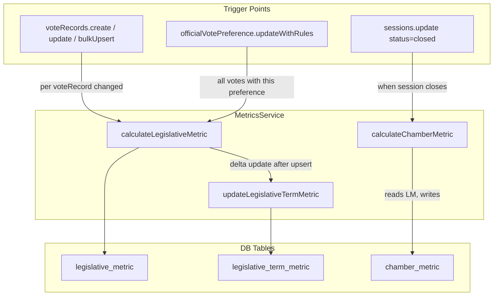
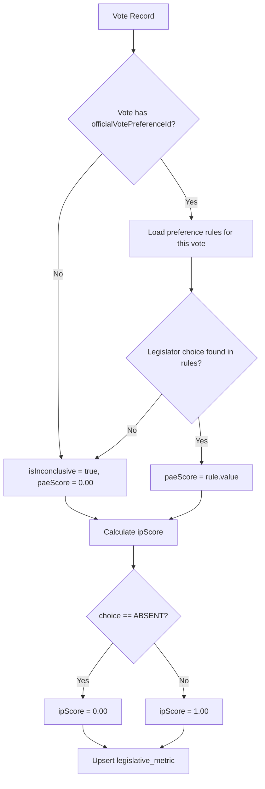
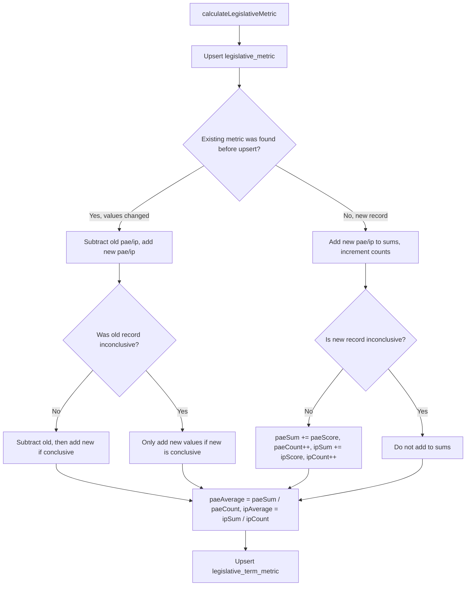

# Metrics Service Implementation Plan

## Overview

Create a dedicated metrics service at [`src/lib/services/metrics.service.ts`](src/lib/services/metrics.service.ts) that encapsulates all political rule logic, and integrate it inline into the existing tRPC routers (`voteRecords`, `officialVotePreference`, `sessions`).

## Data Model (already exists)

The three metric tables are already defined in [`src/lib/db/schema.ts`](src/lib/db/schema.ts):

- `legislativeMetric` (lines 304-327) -- per vote record, atomic fact
- `chamberMetric` (lines 329-336) -- per session+chamber, snapshot IAO
- `legislativeTermMetric` (lines 338-366) -- per person+term, incremental aggregate of PAE/IP

No schema changes are needed, only a migration for performance indexes.

## Architecture



## PAE Score Calculation Logic

The `paeScore` is **not** calculated with a formula. Each `officialVotePreferenceRule` already stores a `value` field (numeric 0.00-1.00) that directly represents the weight of that preference. The service simply looks up the matching rule and uses its `value` as the `paeScore`.



The `value` field in `officialVotePreferenceRule` (`schema.ts` line 282) is defined by the user when creating/editing the preference. Example configuration:

| Rule choice  | priority | value (paeScore) |

|--------------|----------|------------------|

| POSITIVE     | 1        | 1.00             |

| ABSTENTION   | 2        | 0.75             |

| NEGATIVE     | 3        | 0.25             |

| ABSENT       | 4        | 0.00             |

| INCONCLUSIVE | 5        | 0.00             |

But the actual values are fully configurable per preference -- the service reads `rule.value` directly.

Special cases:

- **No `officialVotePreferenceId` on vote**: `isInconclusive = true`, `paeScore = 0.00`
- **Choice not found in rules**: `isInconclusive = true`, `paeScore = 0.00`
- **Choice = INCONCLUSIVE**: `ipScore = 1.00`, `isInconclusive = true`
- **Choice = ABSENT**: `ipScore = 0.00`

## legislativeTermMetric (Incremental Aggregate)

This table stores running aggregates of PAE and IP per `personId + legislativeTermId`. It avoids full table scans when querying a legislator's accumulated performance.

Fields: `paeSum`, `paeCount`, `ipSum`, `ipCount`, `paeAverage`, `ipAverage`.

### Update Flow

`calculateLegislativeMetric` handles the delta update as part of its execution:



### Rules

- Only conclusive records (`isInconclusive = false`) contribute to sums/counts
- When updating an existing `legislativeMetric`: subtract old values first, then add new values (delta approach)
- When transitioning from conclusive to inconclusive: subtract the old values, do not add new
- When transitioning from inconclusive to conclusive: do not subtract (nothing was added), add new values
- If `paeCount` is 0 after an update, set `paeAverage = 0.00` (avoid division by zero)
- The upsert targets `personId + legislativeTermId` as the unique key

## IAO (Chamber Metric) Calculation

```
IAO = AVG(paeScore) WHERE isInconclusive = false AND ipScore = 1.00
```

Triggered once when `sessions.update` sets `status = 'closed'`.

---

## Files to Create/Modify

### 1. New: `src/lib/services/metrics.service.ts`

The core service with four exported functions:

```typescript
/** Calculates and upserts a single legislativeMetric, then delta-updates the legislativeTermMetric. */
export async function calculateLegislativeMetric(
  db: DbType,
  voteRecordData: { voteId: string; legislativeTermId: string }
): Promise<void>

/** Recalculates all legislativeMetrics for every vote that uses a given officialVotePreference. */
export async function recalculateMetricsForPreference(
  db: DbType,
  officialVotePreferenceId: string
): Promise<void>

/** Calculates the chamberMetric (IAO) for a session+chamber. */
export async function calculateChamberMetric(
  db: DbType,
  sessionId: string,
  chamber: "DEPUTY" | "SENATOR"
): Promise<void>
```

Internal helpers:

- `computePaeScore(choice, rules)` -- pure function, finds the matching rule by `choice` and returns `rule.value` as the paeScore.
- `updateLegislativeTermMetric(db, { personId, legislativeTermId, chamber, oldMetric, newMetric })` -- applies a delta update to `legislativeTermMetric`. Called internally by `calculateLegislativeMetric` after the upsert, passing the old metric (if it existed) and the new metric values.

### 2. Modify: [`src/app/api/trpc/routers/voteRecords.ts`](src/app/api/trpc/routers/voteRecords.ts)

- Import `calculateLegislativeMetric` from the service
- In `create` (line 49-55): after inserting, call `calculateLegislativeMetric(ctx.db, { voteId, legislativeTermId })`
- In `update` (line 74-88): after updating, call `calculateLegislativeMetric(ctx.db, { voteId, legislativeTermId })`
- In `bulkUpsert` (line 177-219): after each record upsert, call `calculateLegislativeMetric` for each record

### 3. Modify: [`src/app/api/trpc/routers/officialVotePreference.ts`](src/app/api/trpc/routers/officialVotePreference.ts)

- Import `recalculateMetricsForPreference` from the service
- In `updateWithRules` (line 156-195): after updating rules, call `recalculateMetricsForPreference(ctx.db, id)`

### 4. Modify: [`src/app/api/trpc/routers/sessions.ts`](src/app/api/trpc/routers/sessions.ts)

- Import `calculateChamberMetric` from the service
- In `update` (line 67-81): after updating, if the new status is `'closed'`, call `calculateChamberMetric(ctx.db, id, result.chamber)`

### 5. New: [`src/app/api/trpc/routers/metrics.ts`](src/app/api/trpc/routers/metrics.ts)

Read-only tRPC router for querying metrics (no mutations, metrics are only written by the service):

- `metrics.listByVoteId({ voteId })` -- list all legislativeMetrics for a vote
- `metrics.listByPersonId({ personId })` -- list all legislativeMetrics for a person
- `metrics.getChamberMetricBySessionId({ sessionId })` -- get chamberMetric for a session
- `metrics.getTermMetric({ personId, legislativeTermId })` -- get the aggregated legislativeTermMetric for a specific person+term
- `metrics.listTermMetricsByPersonId({ personId })` -- list all legislativeTermMetrics for a person across terms

### 6. Modify: [`src/app/api/trpc/router.ts`](src/app/api/trpc/router.ts)

- Register the new `metricsRouter`

### 7. New migration for indexes

Create a Drizzle migration adding composite indexes for query performance:

- `legislative_metric(vote_id)` -- for lookups when recalculating by vote
- `legislative_metric(person_id, legislative_term_id)` -- for person-level queries
- `legislative_metric(session_id, chamber)` -- for IAO aggregation
- `legislative_term_metric(person_id, legislative_term_id)` -- unique constraint + fast lookup for delta updates
- `chamber_metric(session_id, chamber)` -- for session lookups

---

## Do's and Don'ts

| Do | Don't |

|----|-------|

| Use `numeric` type for scores (already in schema) | Use floating-point arithmetic for scores |

| Upsert legislativeMetric (ON CONFLICT by voteId + legislativeTermId) | Insert duplicates for the same vote+term combo |

| Wrap metric calculations in try/catch so failures don't crash the main mutation | Let metric calculation errors propagate and break vote saving |

| Use the `calculationVersion` field as a string constant (e.g., `"v1"`) | Leave calculationVersion empty |

| Keep `computePaeScore` as a pure function for testability | Embed business rules inline in router procedures |

| Calculate chamberMetric only when session transitions to `closed` | Recalculate chamberMetric on every vote change |

| Filter out `isInconclusive = true` and `ipScore != 1.00` when computing IAO | Include inconclusive/absent votes in IAO |

| Use delta updates (subtract old + add new) for `legislativeTermMetric` | Re-scan all legislativeMetrics to rebuild term aggregates |

| Guard against division by zero when `paeCount` or `ipCount` is 0 | Assume counts are always positive |

| Only add conclusive records to `legislativeTermMetric` sums | Add inconclusive records to running totals |